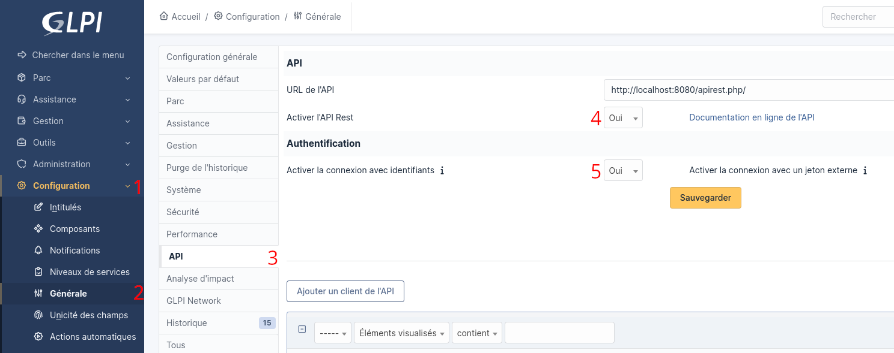
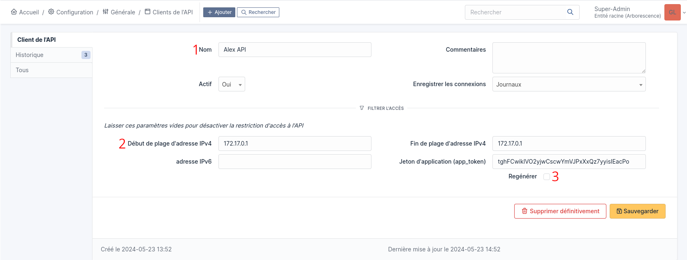
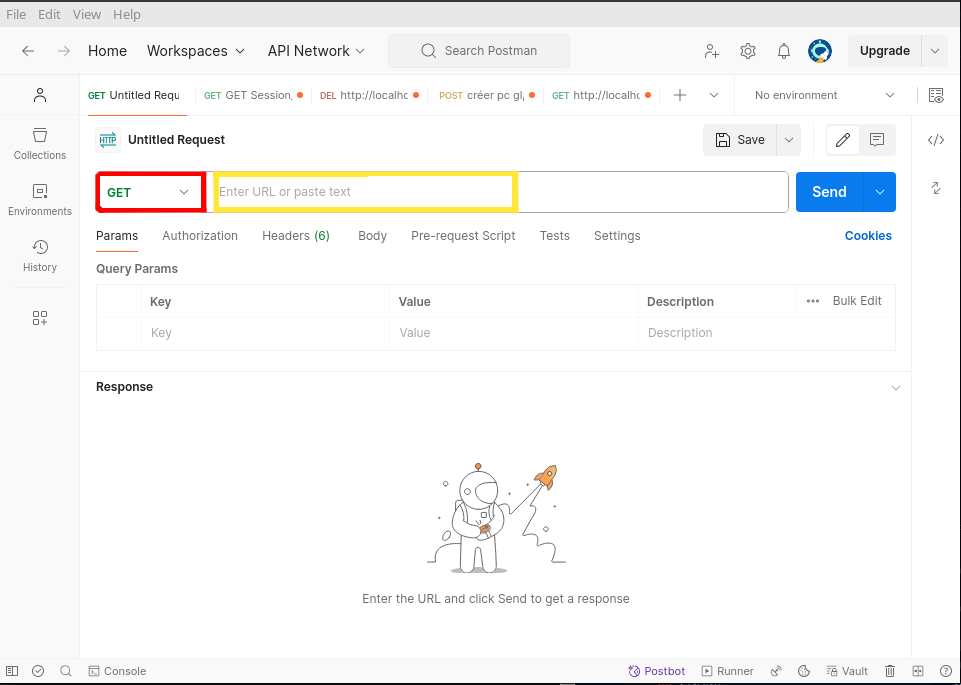
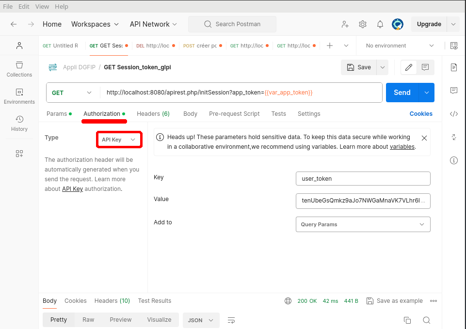
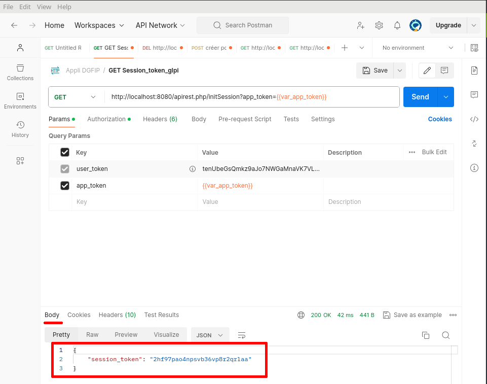
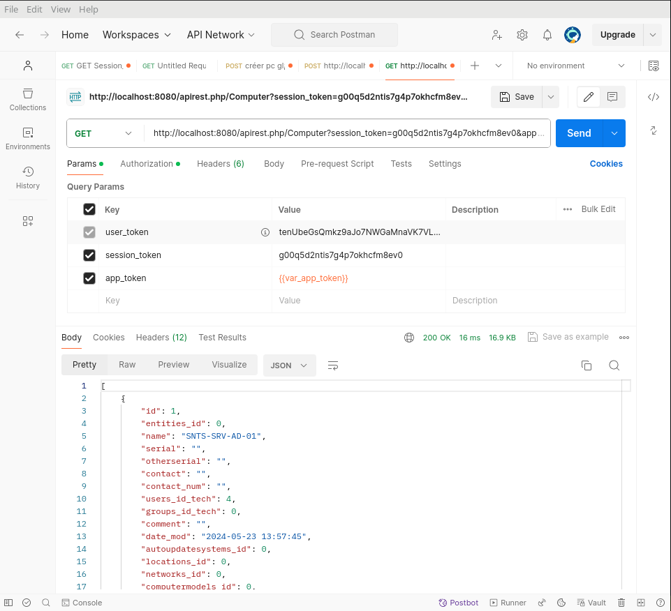
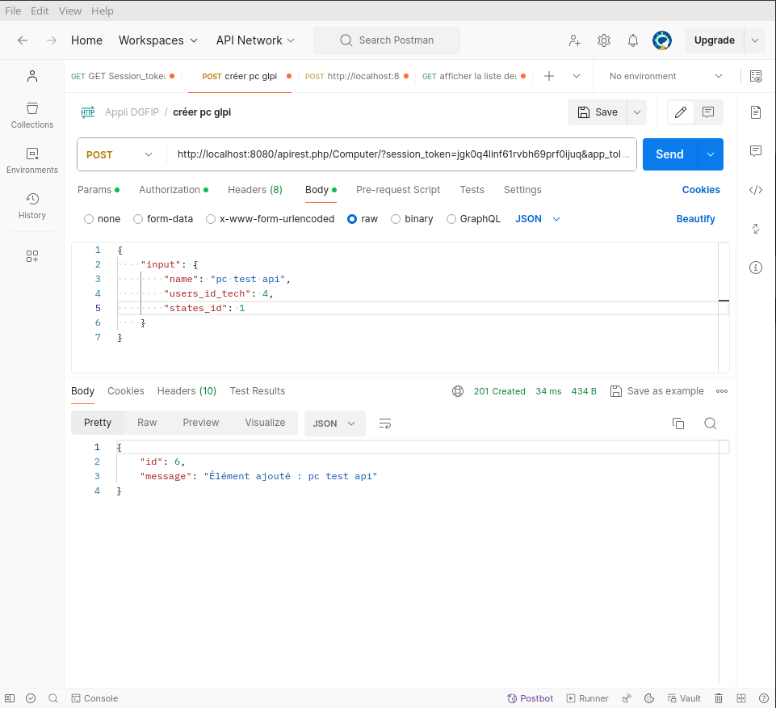
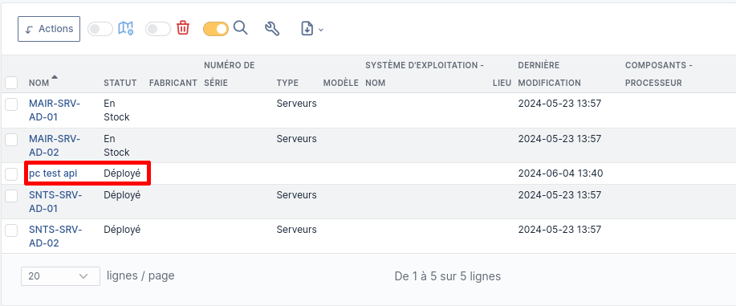
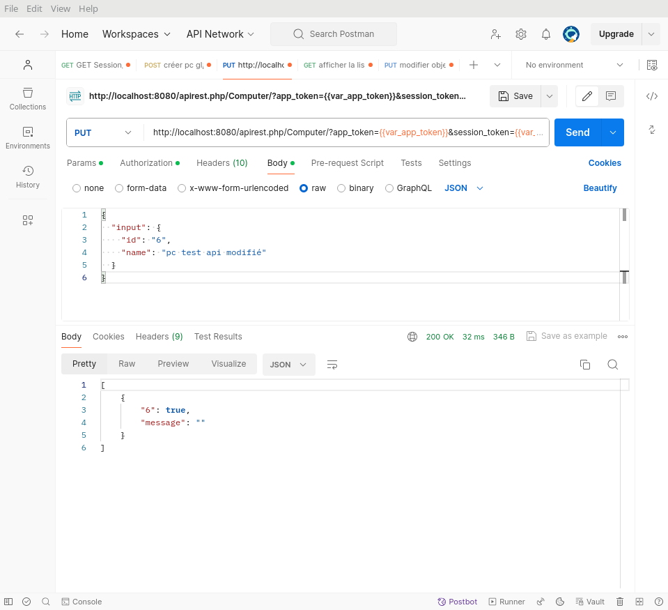
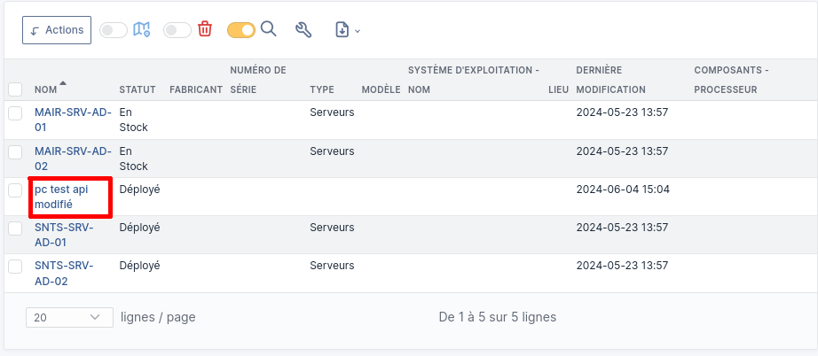

Dans le cadre de la validation de mon cursus d'étude, je dois réaliser un projet de fin d'études.
Projet qui doit être réalisé au sein de l'entreprise où je me trouve.

Le projet consiste à créer une application Android qui permet, via l'API de GLPI, de mettre à jour la base de données.

:::info
Ce projet est abandonné et ne s'est jamais fini, il n'y aura donc pas de suite
:::

<!--truncate-->

L'application devra :

- Être simple d'utilisation
- Permettre d'affecter un équipement un utilisateur
- Permettre de changer l'affectation d'un équipement à un utilisateur
- Changer le statut d'un équipement

## Technologies utilisées

### Flutter
Flutter, c'est un outil gratuit de Google qui te permet de créer des applis pour mobile, web et ordinateur avec un seul code. En gros, tu écris ton code une fois et tu peux le faire tourner partout. Il utilise un langage appelé Dart, mais l'important, c'est que tu peux faire de super belles interfaces rapidement et facilement. C'est super pratique pour avoir une appli qui marche bien et qui a le même look sur toutes les plateformes.

### Postman
Postman, c'est un outil super pratique pour tester des API. Tu peux envoyer des requêtes HTTP et voir les réponses, sans avoir à écrire du code compliqué. En gros, c'est comme un couteau suisse pour les développeurs qui bossent avec des API : tu peux tester, déboguer, et documenter tes endpoints super facilement. C'est super utile pour vérifier que tout fonctionne bien avant de mettre en ligne ton application.

### GLPI (dans un Docker)
GLPI, c'est un outil open-source pour gérer tout ce qui concerne l'informatique dans une entreprise. Il t'aide à suivre les équipements, gérer les tickets de support, et organiser les tâches de maintenance. En gros, c'est comme un tableau de bord pour tout ce qui touche à l'IT : tu sais toujours ce qui se passe, où sont tes ressources, et quelles sont les priorités. Super utile pour garder tout en ordre et résoudre les problèmes rapidement.

N'ayant pas eu l'autorisation de ma hiérarchie pour accéder à l'API du GLPI de l'entreprise, j'en ai donc installé un en local grâce à Docker sur mon pc personnel. 

---

## Premiers pas
Dans cette première partie, le but est de prendre en main *Postman* que j'utiliserai durant ce projet, comme expliquer plus haut, pour faire des appels à l'API de GLPI.

Comme c'est la première fois que j'utilise Postman, je ne comprends pas grand-chose, raison pour laquelle j'ai une petite ToDo list.

Mon but, c'est donc :
- D'activer l'API
- Faire mes premiers call avec Postman sur l'API de GLPI

C'est pas beaucoup, mais ça a été un sacré bordel, surtout au niveau de Postman.

## Activer l'API de GLPI

Rien de bien compliqué. Si vous avez un full accès à votre GLPI, rendez vous dans *Configuration (1)* > *Général (2)* > *API (3)* > *Activer l'API Rest (4)* > *Activer la connexion avec identifiants (5)* et enfin cliquez sur *Sauvegarder*



Voilà, donc maintenant l'API est activé, il faut ensuite rajouter un nouveau client de l'API, c'est le bouton qui se trouve juste en dessous.

Donner un nom (1), ensuite définir la plage d'adresse IP qui sera utiliser par l'API, ici, c'est le range du Docker (2) et pour finir, faut s'assurer que la case "*Regénérer*" est cochée, ce qui permettra d'avoir un jeton, on en aura besoin pour plus tard.


### La documentation

Maintenant que le client est créé et que l'API est activée, il est temps de s'y rendre.
De retour sur la section consacrée à l'API, il y a une ligne appelée *URL de l'API* avec un lien vers celle-ci, qui est (dans mon cas): `http://localhost:8080/apirest.php/`

En se rendant sur cette page, on a donc accès à la documentation complète de l'API, ce qui va être très utile par la suite avec Postman.

## Utilisation de Postman

Postman, ça ressemble à ça :


En rouge, c'est les requêtes HTTP. Celles qui nous intéressent sont :
- **GET** qui a pour but d'aller chercher une page ou de la donnée.
- **POST** a pour but d'envoyer de l'information contenue dans le ***body*** de la requête, vers le serveur.
- **PUT** va écraser une ressource avec de la nouvelle donnée, là aussi définie dans le ***body***.
- **DELETE** je pense pas avoir besoin d'expliquer.

En jaune, c'est l'URL qui comporte toutes les *query* qui sont des données au format `clé=valeur` après un `?`.


Par exemple : `leboncoin.fr/recherche/?category=9&locations=r_12`

Les champs *category* et *location* sont des *query*.

### Premier call vers l'API

Pour initialiser la première connexion, il faut d'abord savoir quoi faire. Donc, direction la documentation, section ***Init session***. Cette requête va permettre de générer un token de session qui servira à l'utilisation de l'API. Pour générer cette requête, on va avoir besoin de certains paramètres. Il y a le choix entre 2 solutions : 

- l'utilisation d'un *user_token* (qui est la méthode la plus simple) 

- l'*App-Token* couplé avec un *login* et *password*.

On va donc prendre la première option. 

:::info
Pour récupérer ce token, faut aller dans *Administration* > *Utilisateurs* > *\{username\}* et, tout en bas de la page, dans la section **Clef d'accès distant** doit apparaître le *Jeton d'API*. S'il n'est pas dispo, coche juste la case *Regénéré* à droite et clique sur *Sauvegarder*.
:::

On copie la clé et on retourne sur Postman.



Faut aller dans la section *Authorization* et dans le menu déroulant **Type** chercher ***API KEY***. Pour la Key, faut donc écrire *user_token* et dans Value, coller la clé copiée juste avant.

Ensuite dans ***Params*** rajoute l'**app_token** généré plus haut en activant l'API.

Et si tout est bon tu devrais dois un token de session qui apparaît dans le *Body* juste en dessous et qui se régénère à chaque exécusion de la commande.

Comme ceci:


Ce token va être utile pour les autres commandes que je vais devoir exécuter, donc faut le garder dans un coin.

### Lister les tous les ordis

Pour que ça puisse fonctionner, il faut bien évidemment une liste d'ordis créés au préalable. J'en ai créé 4, on devrait donc en voir 4 de listé.

Donc le but, c'est de lister tous les items, pour ce faire, direction la documentation une nouvelle fois dans la section **Get all items**. L'url est `apirest.php/:itemtype/`. Il faut logicement remplacer `:itemtype` par `Computer` vu que c'est ce que je cherche à afficher ici.

l'url devrait donc ressembler à un truc comme ça : `http://localhost:8080/apirest.php/Computer`

**Paramètres :**
- Session-Token : qui est obligatoire.
- App-Token : qu'est pas obligatoire, mais si je ne le mets pas ça ne fonctionne pas...
- Session_token : c'est pas indiqué dans la doc, mais j'ai un message d'erreur si j'le mets pas...

Après avoir ajouté tout ça, et cliqué sur **Send** j'obtiens donc un résultat, que voici :


Okay ! Parfait, ça fonctionne ! On va pouvoir passer à la suite, c-à-d *ajouter* un nouvel ordinateur dans la liste.

### Ajouter un nouvel ordinateur

Pour ajouter un objet, il va falloir changer le type de requête, faut passer en mode **POST**. L'url reste le même qu'avant, les paramètres de query sont les mêmes cependant maintenant faut définir le pc qu'on veut créer.

Donc pour ça faut aller dans **Body** et sélectionner *raw* et c'est là dedans qu'on va pouvoir personnaliser notre premier pc créer via l'API.

et j'ai ajouté cet input :

    ```
    {
    "input": {
        "name": "pc test api",
        "users_id_tech": 4,
        "states_id": 1
        }
    }
    ```

Ce qui m'a rendu ce résultat :


Donc maintenant il ne reste plus qu'à vérifier qu'il est bien présent dans la liste des pc de GLPI.



Ça y est ! Notre premier objet a été créé dans GLPI grâce à l'API !!

### Modifier un élément

Bon c'est super, mais le but de l'application c'est aussi de pouvoir modifier des choses.

Pour modifier c'est rien de bien compliqué, on va prendre l'exact même URL que pour l'ajout, on va modifier la commande par **PUT** et dans le body on va mettre ceci (en ayant repéré l'id de l'objet que l'on souhaite modifier ):

    ```
    {
    "input": {
        "id": "6",
        "name": "pc test api modifié"
        }
    }
    ```

Une fois la commande exécutée, on devrait avoir un message comme suivant :


Et pour vérifier que la commande a bien été prise en compte, il suffit de se rendre dans GLPI.


Et voilà ! Je sais à présent :
- Me connecter à l'API
- Ajouter un objet dans GLPI
- Et le modifier 