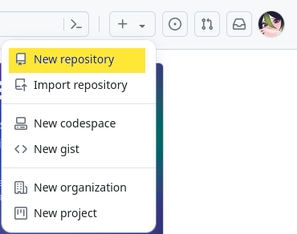
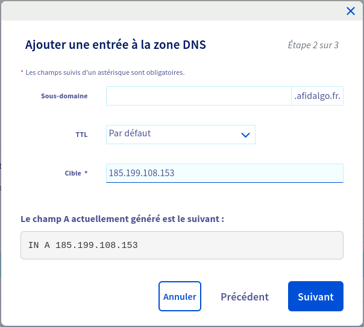
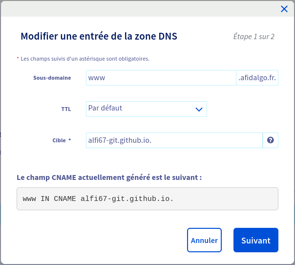
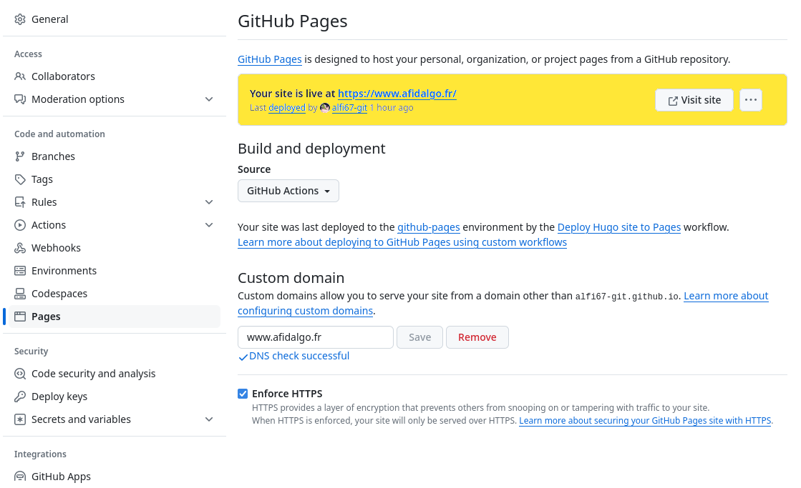

Il existe une solution pour héberger votre site web gratuitement avec GitHub, c'est ce que nous allons apprendre à faire dans ce tutoriel.

<!--truncate-->

## Mise en place du repository
Dans un premier temps, rendez-vous sur Github et au niveau de votre photo de profil, cliquer sur le + et créez un nouveau repo.

Une nouvelle page apparaît ensuite, votre repo doit avoir le nom *username*.github.io, faite également en sorte qu'il soit *public*. Vous pouvez donner une description à votre repository, mais ça n'est pas obligatoire.

À présent, il faut push votre dossier sur lequel vous avez durement travaillé. 

## Mise en ligne du site

Une fois votre repo créé et vos fichier uploadés, il est temps de publier votre site.

Dans les paramètres, rendez-vous dans la partie *pages*.

Dans la partie **Build and deployment** sélectionnez la *Source*, qui est: 

- soit *GitHub Actions* 
- soit *Deploy from a branch*

À vous de sélectionner le bon en fonction de votre configuration, mais dans la majorité des cas ça sera la deuxième option.

Sélectionnez également la *Branch* de votre repo et sauvegardez. Dans quelques instant, un message vous disant que votre site est publié devrait apparaître.

Et voilà ! Votre site est publié ! Vous pouvez le partager au monde entier !

## Nom de domaine personnalisé

Votre site est publié, c'est très chouette, mais vous n'êtes pas très satisfait du nom de domaine par défaut donné par GitHub. Pas de panique, vous pouvez le changer, et ceci très facilement !

Si vous avez acheté un nom de domaine auprès d'un fournisseur, vous pouvez préciser à GitHub le nom de domaine de votre souhait.

Pour ce faire, vous devez faire quelques ajouts au niveau de votre fournisseur. 

Ici, nous prendrons le cas d'OVH puisque c'est celui que j'utilise, mais les ajouts à faire sont les mêmes peu importe le fournisseur.

### Définir le nom de domaine

Avant tout, il est recommandé de renseigner votre nom de domaine avant de procéder aux divers ajouts. Une fois renseigner, cliquez sur *Save* et attendez quelques secondes que la vérification DNS s'effectue.

### Configurer la résolution de nom
Il à présent temps de voir un oeil au niveau de la configuration de notre nom de domaine.

Rendez-vous sur le site de votre fournisseur de nom de domaine, sélectionnez votre nom de domaine et rajoutez une nouvelle entrée.

1. Sélectionnez le champ **A** (qui permet d'associer un nom de domaine à une adresse IP)
2. Définissez en cible les serveurs de GitHub (plusieurs sont possibles, mais un seul suffis)

    2.1. Laissez le sous domaine vide

    2.2. Définissez la cible comme `185.199.108.153`

3. Ajouter un **CNAME** (similaire au champ A, mais permet de définir un nom alternatif) 

    3.1. Définissez le sous domaine comme `www`

    3.2. Définissez la cible comme `pseudogit.github.io`

Et si vous retournez sur GitHub vous devrez avoir un message tout en haut de la page vous précisant que votre site est bien publié et fonctionne avec le nom de domaine affilié.

Et voilà, votre site est publié avec un nom de domaine personnalisé, le tout gratuitement !

À bientôt pour de nouvelles aventures sur les internets 🤓 !