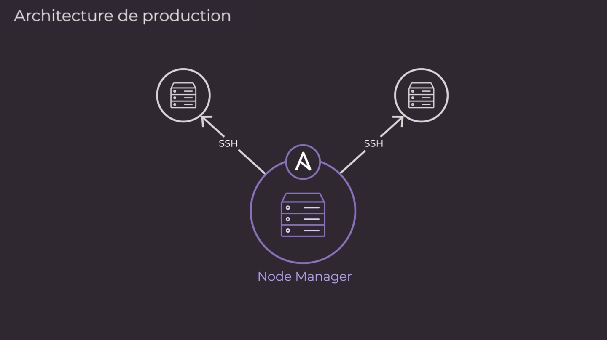

Rebelote, pour la validation de ma 3e année d'étude, je dois réaliser un nouveau projet. Cette fois-ci ça sera sur l'automatisation du déploiement de fichier de configuration de switch à l'aide d'Ansible.

:::warning
Cet article est encore en cours de rédaction, le projet venant juste de commencé. N'hésitez pas à revenir plus tard pour voir l'évolution du projet.
:::

<!--truncate-->

---

Ce projet doit permettre :
- L'automatisation de déploiement de script de configuration de switch
- La mise à jour automatique des fichiers de conf
- Sauvegarder les fichiers de configuration sur Git
- Permettre le rollback en cas de défaillance

## Technologies utilisées

### 🔗 Git, c'est quoi ?

Git est un **système de gestion de versions** qui permet de **suivre l’évolution des fichiers** dans un projet, principalement du code source.

Avec Git, tu peux :

✅ **Sauvegarder et suivre les modifications** d’un projet au fil du temps

✅ **Revenir à une version précédente** en cas d’erreur

✅ **Travailler à plusieurs** sans écraser les modifications des autres

✅ **Expérimenter avec des branches** avant d’intégrer des changements dans le projet principal

Git est un outil **distribué**, c’est-à-dire que **chaque copie du projet contient tout l’historique des modifications**, sans dépendre d’un serveur central.

### ⚙️ Ansible, c'est quoi ?

Ansible est un **outil d'automatisation** qui permet de **gérer des serveurs, installer des logiciels et configurer des systèmes** de manière simple et efficace.

Avec Ansible, tu peux :

✅ **Gérer plusieurs machines en même temps** avec un seul script

✅ **Automatiser les tâches répétitives** comme l’installation de logiciels

✅ **Éviter les erreurs humaines** grâce à des configurations reproductibles

✅ **Utiliser un système sans agent**, car Ansible fonctionne via **SSH** (pour Linux) et **WinRM** (pour Windows)

Ansible est **déclaratif** : tu écris ce que tu veux obtenir (ex: "Apache installé"), et il s’occupe du comment.

#### Comment ça marche ?

1. **Machine de contrôle** : Un serveur où Ansible est installé (peut être ton PC ou un serveur dédié).
2. **Machines cibles** : Serveurs à configurer, accessibles en SSH.
3. **Inventaire** : Un fichier listant les machines cibles.
4. **Playbooks** : Scripts YAML définissant les actions à exécuter (installer un package, modifier un fichier, redémarrer un service, etc.).

```yaml
- name: Installer Apache
  hosts: webservers
  become: yes  # Exécuter en tant que root
  tasks:
    - name: Installer le package Apache
      apt:
        name: apache2
        state: present
```
👉 Ici, Ansible va se connecter aux machines du groupe webservers et installer Apache.

Pour rentrer un peu plus dans les détails, Ansible automatise la gestion des systèmes distants et contrôle leur état souhaité.


Comme montré dans la figure précédente, la plupart des environnements Ansible comportent trois composants principaux :

**Nœud de contrôle :**

Un système sur lequel Ansible est installé. Vous exécutez les commandes Ansible telles que `ansible` ou `ansible-inventory` sur un nœud de contrôle.

**Inventaire :**

Une liste de nœuds gérés qui sont organisés de manière logique. Vous créez un inventaire sur le nœud de contrôle pour décrire les déploiements d'hôtes à Ansible.

**Nœud géré :**

Un système distant, ou hôte, qu'Ansible contrôle.

## Premiers test

Etant donnée que c'est la première fois que j'utilise Ansible, il faut bien que je puisse me faire la main dessus et comprendre comment ça fonctionne. Pour ce faire j'ai donc créer un petit lab de VMs sur VMware Workstation.

Pour réaliser ce lab j'ai donc poser la question à ChatGPT de m'en proposer une et voici sa réponse :

#### 🖥 Configuration minimale (3 VMs)

1. **1 VM de contrôle** (où Ansible est installé)
2. **2 VMs cibles** (serveurs gérés par Ansible)

👉 **Pourquoi ce setup ?**

- 1 machine pour exécuter Ansible
- 2 machines cibles pour tester l'exécution sur plusieurs serveurs

#### 🏗 Configuration recommandée (4+ VMs)

Si tu veux tester différents rôles et services, voici une config plus avancée :

1. **1 VM "Control Node"** (Fedora/Debian/Ubuntu) → Contient Ansible
2. **1 VM "Web Server"** (Ubuntu/Debian/CentOS) → Pour tester le déploiement d’Apache/Nginx
3. **1 VM "Database Server"** (Ubuntu/Debian/CentOS) → Pour tester l’installation de MySQL/PostgreSQL
4. **1 VM "Client"** (Fedora/Debian) → Pour tester la connexion aux services


### 📌 Le lab :
Voici donc l'état du lab actuellement : 

1. **1 VM de contrôle** (OS Fedora Server où Ansible est installé)
2. **2 VMs cibles** (OS Debian serveurs gérés par Ansible)

👉 **Pourquoi ce setup ?**

- 1 machine pour exécuter Ansible
- 2 machines cibles pour tester l'exécution sur plusieurs serveurs


### 🌐 IP du lab :

✅ **vm-fedo-ansible →** 192.168.2.134

✅ **vm-deb-ansible   →** 192.168.2.135

✅ **vm-deb-ansible2 →** 192.168.2.136



### 💡 Infos sur Ansible :


> Un **node manager**, ou ***control node***,  est un poste qui contrôle les nodes grâce à sa connexion SSH. Il dispose d'une version Ansible d’installé pour leur pousser les tâches d’automatisation grâce aux commandes `ansible` et `ansible-playbook`. Ça peut être n’importe quelle machine Linux, mais pas Windows.


> Un **node** (ou ***managed node***, ou ***host***) est un poste connecté au node manager en SSH, et sur lequel Ansible viendra pousser les tâches d’automatisation. Ansible n’est pas installé sur les nodes.