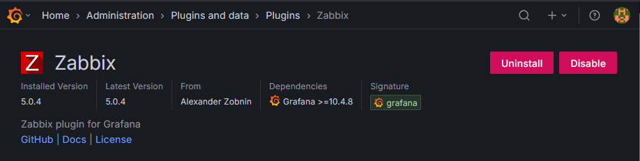
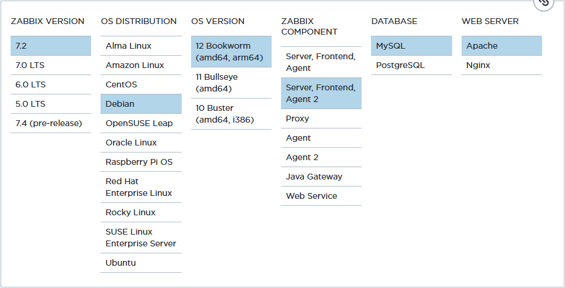
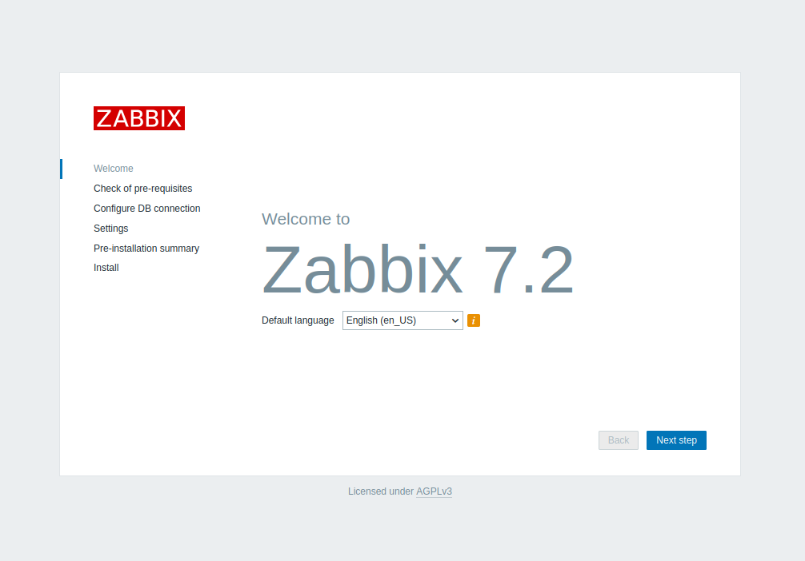
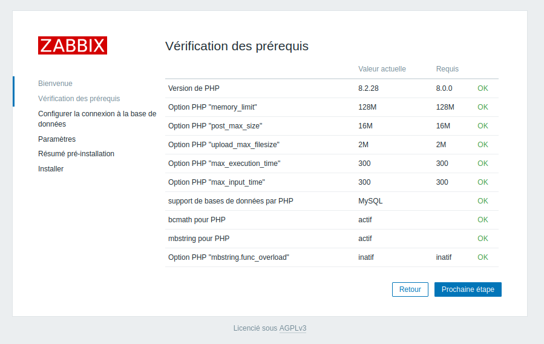
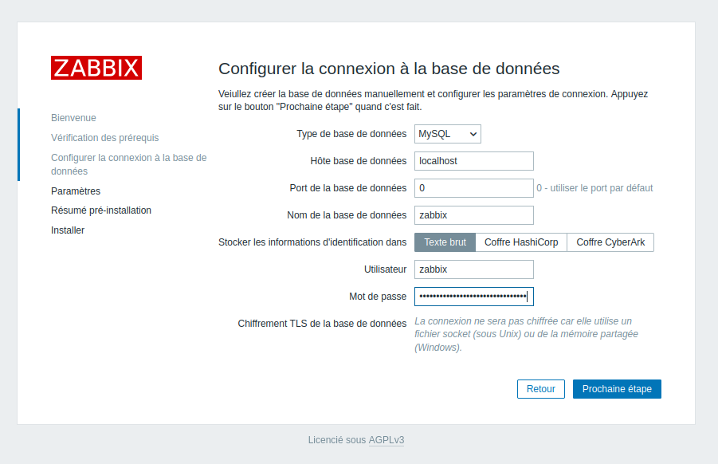
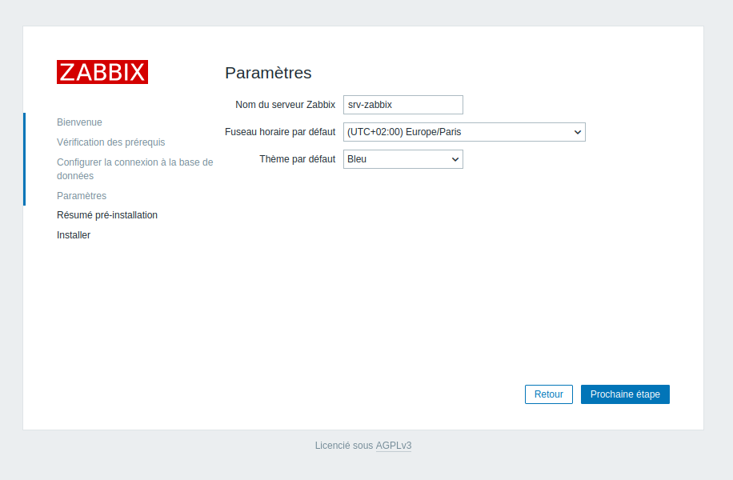
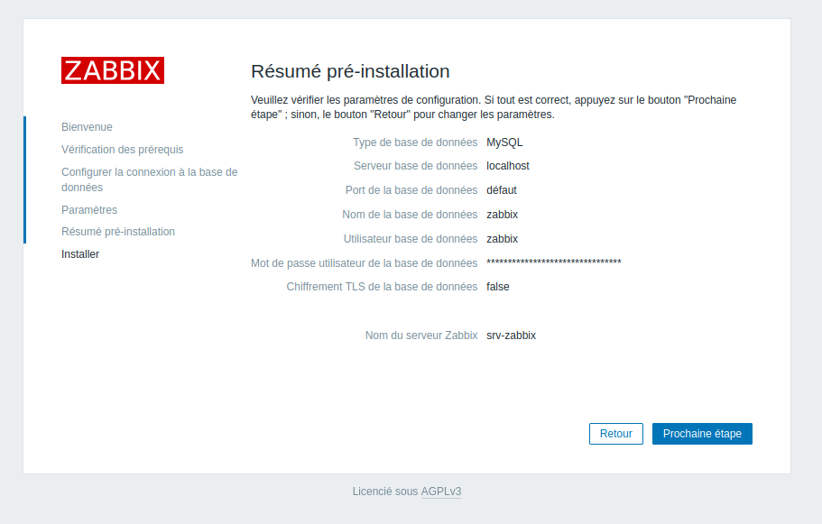
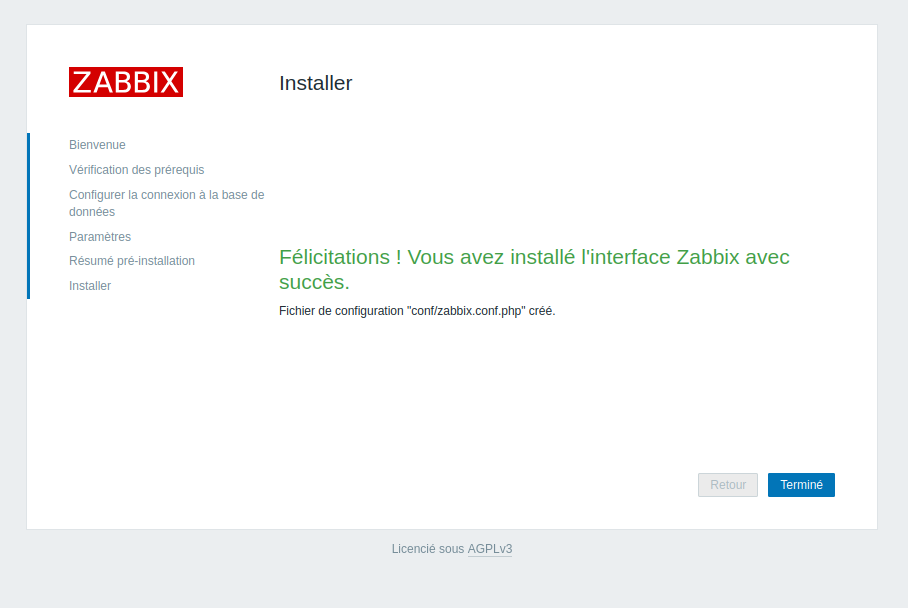
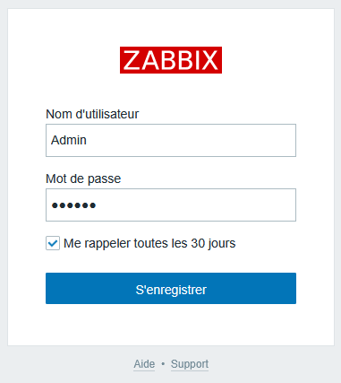
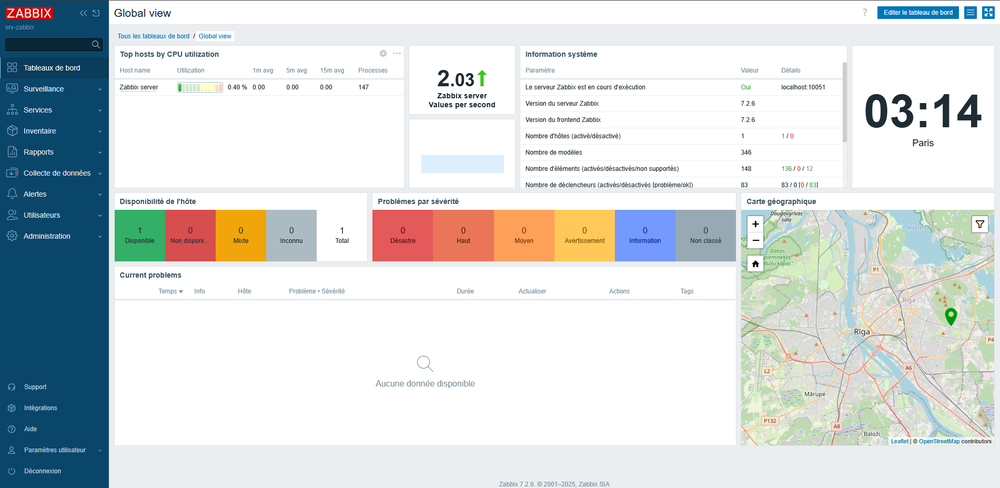

Pour garder un œil sur ce qu'il se passe sur mon lab, j'avais besoin d'un outil de supervision. Comme j'avais déjà aidé à le mettre en place dans une précédente entreprise durant l'une de mes alternances, et par conséquent, j'avais déjà un peu d'expérience avec, je suis parti sur Zabbix.

Si déjà, je le mets en place, je me suis dit : "pourquoi ne pas en faire une doc ?!".

Alors voici : **Comment installer Zabbix sur Debian**

<!-- truncate -->

## Zabbix c'est quoi ?
Avant de commencer, ça peut être bien de faire une petite introduction à la solution que j'ai choisi d'utiliser.

Zabbix, c’est une solution de supervision open source ultra complète, taillée pour monitorer toute ton infra IT 
– serveurs, VMs, bases de données, équipements réseau, applis, cloud, conteneurs, et même des trucs plus exotiques via des agents ou du SNMP (on verra ça plus tard).

L’idée ? Avoir une vision en temps réel de la santé de ton système, détecter les pannes avant que ça crame, et centraliser les alertes avec des triggers personnalisables. 
Tu poses tes seuils, tu configures tes graphes, et tu pilotes tout via une interface web un peu old school, mais super efficace.

C’est scalable, ça gère les templates, l’auto-discovery, et l’API est ouverte pour s’intégrer dans ta stack. 
Bref, Zabbix c’est le couteau suisse de la supervision, quand tu veux vraiment garder le contrôle sur ton infra.

## Installation de Zabbix

Il est possible d’installer Zabbix de 2 façons. Soit avec des packages et donc avec une VM attitrée, soit avec Docker. J’ai choisi l’option VM. 

Pourquoi ? 
Car en fouillant un peu la [Documentation](https://www.zabbix.com/documentation/current/en/manual/installation/containers) (qui est très bien faite), 
je me suis rendu compte qu’il n’y avait de disponible que des docker file pour Ubuntu. 
Bien qu'Ubuntu soit basé sur Debian, j’ai préféré éviter de me complexifier la vie, et j’ai simplement installé une nouvelle VM.

Bien pour commencer, ce qu’on peut faire, c’est commencer par installer le plugin pour Zabbix dans Grafana. 
Pour ce faire, il faut se rendre dans le conteneur Grafana et lancer la commande suivante : 

```bash
grafana cli plugins install alexanderzobnin-zabbix-app
```

Bien que le plugin soit installé, il faut encore l’activer.

Pour ce faire, il faut se rendre dans le menu *Administration > Plugins and Data > Plugins > Zabbix* et enfin cliquer sur le bouton *Enable*



Une fois ceci fait, on peut passer à l’installation de Zabbix sur la VM.

## Mettre à jour le système

```bash
sudo apt -y update && sudo apt upgrade && sudo apt full-upgrade && sudo apt autoclean && sudo apt clean
```

## Installer le serveur de base de données MariaDB

```bash
sudo apt install mariadb-server mariadb-client -y
```

Maintenant que c'est fait, il faut démarrer le service, l’activer et enfin effectuer une sécurisation de base à l’aide du script “mysql_secure_installation”

```bash
sudo systemctl start mariadb
sudo systemctl enable mariadb
sudo mysql_secure_installation
```

Voici la configuration que j’ai effectué:

```
NOTE: RUNNING ALL PARTS OF THIS SCRIPT IS RECOMMENDED FOR ALL MariaDB
      SERVERS IN PRODUCTION USE!  PLEASE READ EACH STEP CAREFULLY!

In order to log into MariaDB to secure it, we'll need the current
password for the root user. If you've just installed MariaDB, and
haven't set the root password yet, you should just press enter here.

Enter current password for root (enter for none):
OK, successfully used password, moving on...

Setting the root password or using the unix_socket ensures that nobody
can log into the MariaDB root user without the proper authorisation.

You already have your root account protected, so you can safely answer 'n'.

Switch to unix_socket authentication [Y/n] n
 ... skipping.

You already have your root account protected, so you can safely answer 'n'.

Change the root password? [Y/n] n
 ... skipping.

By default, a MariaDB installation has an anonymous user, allowing anyone
to log into MariaDB without having to have a user account created for
them.  This is intended only for testing, and to make the installation
go a bit smoother.  You should remove them before moving into a
production environment.

Remove anonymous users? [Y/n] y
 ... Success!

Normally, root should only be allowed to connect from 'localhost'.  This
ensures that someone cannot guess at the root password from the network.

Disallow root login remotely? [Y/n] y
 ... Success!

By default, MariaDB comes with a database named 'test' that anyone can
access.  This is also intended only for testing, and should be removed
before moving into a production environment.

Remove test database and access to it? [Y/n] y
 - Dropping test database...
 ... Success!
 - Removing privileges on test database...
 ... Success!

Reloading the privilege tables will ensure that all changes made so far
will take effect immediately.

Reload privilege tables now? [Y/n] y
 ... Success!

Cleaning up...

All done!  If you've completed all of the above steps, your MariaDB
installation should now be secure.

Thanks for using MariaDB!
```

## Ajout des dépots Zabbix

Direction la page de [Téléchargement](https://www.zabbix.com/download?zabbix=7.2&os_distribution=debian&os_version=12&components=server_frontend_agent_2&db=mysql&ws=apache) pour choisir ce que l’on souhaite installer




Ces commandes permettent d’installer les **dépôts officiel** pour Zabbix.

```bash
wget https://repo.zabbix.com/zabbix/7.2/release/debian/pool/main/z/zabbix-release/zabbix-release_latest_7.2+debian12_all.deb
sudo dpkg -i zabbix-release_latest_7.2+debian12_all.deb
sudo apt update 
```

## Installation de Zabbix server, du frontend et de l’agent2

```bash
sudo apt install zabbix-server-mysql zabbix-frontend-php zabbix-apache-conf zabbix-sql-scripts zabbix-agent2 
```

et une fois fait, on installe également les plugins :

```bash
sudo apt install zabbix-agent2-plugin-mongodb zabbix-agent2-plugin-mssql zabbix-agent2-plugin-postgresql 
```

## Configuration de la base de donnée

Se connecter à mysql :

```bash
sudo mysql -u root
```

Et rentrer les commandes suivantes :

```sql
create database zabbix character set utf8mb4 collate utf8mb4_bin;
create user zabbix@localhost identified by 'password';
grant all privileges on zabbix.* to zabbix@localhost;
set global log_bin_trust_function_creators = 1;
quit; 
```

Il faut maintenant importer le schéma initial de Zabbix en utilisant le compte utilisateur nouvellement créé, ainsi que son mot de passe :

```bash
zcat /usr/share/zabbix/sql-scripts/mysql/server.sql.gz | mysql --default-character-set=utf8mb4 -uzabbix -p zabbix 
```

Dès que fait, il faut désactiver l’option après l’importation du schéma de la db:

```sql
set global log_bin_trust_function_creators = 0;
quit; 
```

## Configuration de Zabbix Server

Plus qu’à définir le mot de passe pour la database de Zabbix, pour ça, il faut aller dans `/etc/zabbix/zabbix_server.conf`

```bash
DBPassword=password
```

Plus qu’à redémarrer les services :

```bash
systemctl restart zabbix-server zabbix-agent apache2
systemctl enable zabbix-server zabbix-agent apache2 
```

## Finalisation de l'installation

Maintenant, que tout est installé, il suffit juste de se rendre sur l’url du site : 
[`http://ip-de-votre-machine/zabbix`](http://ip-de-votre-machine/zabbix) et votre page devrait apparaitre comme ceci :



Pour des raisons de simplicité, je vais sélectionner la langue Fr, mais rien ne vous empêche de laisser en anglais. Dans tous les cas, ce paramètre est modifiable plus tard.

Assurer vous que toutes les vérifications des prérequis sont OK comme suivant:



Sinon, installez ce qu’il vous manque.

Remplissez ici en fonction vos paramètres à vous:









Pour la première connexion, il faut utiliser les identifiants provisoire.

- **Nom d’utilisateur** : Admin
- **Mot de passe** : zabbix

<div style={{textAlign: 'center'}}>

</div>

Ce qui donne à présent accès, à cette page-ci :



Et voilà, félicitation vous avez installer Zabbix avec succès !
<div style={{textAlign: 'center'}}>

</div>

La version *no brain* de l'installation de Zabbix est dispo dans ma doc. Par *no brain* j'entends, bêtement copier coller les commandes
