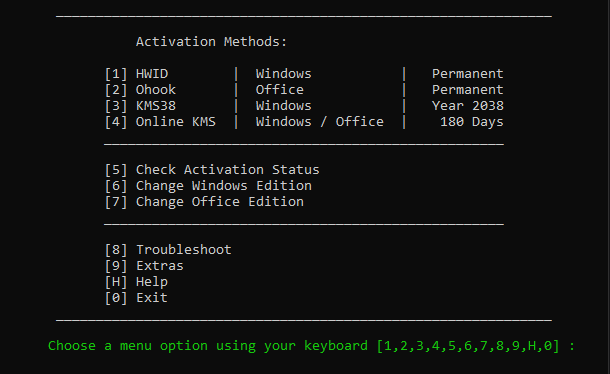

# Activer sa license Windows gratuitement

Pour activer sa license Windows gratuitement, on va utiliser un script trouvable sur Git, appelé **Microsoft Activation Script (MAS)** trouvable [ici](https://github.com/massgravel/Microsoft-Activation-Scripts).

# Comment l'utiliser ?

1️⃣ Ouvrir un PowerShell (pas un CMD).

2️⃣ Copier et coller la commande suivante dans le terminal et appuyer sur *Entrer*
```shell
irm https://get.activated.win | iex
```
3️⃣ La fenêtre suivante s'ouvre. Sélectionner l'option 1 pour l'activation de Windows



4️⃣ C'est tout.